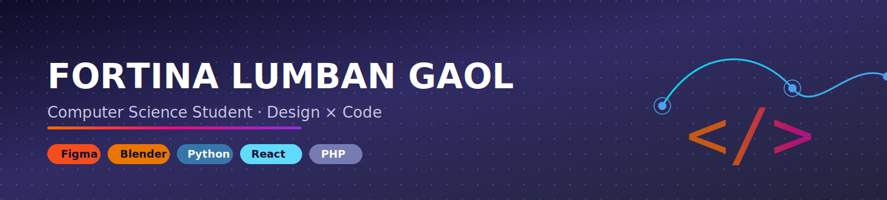

  

  

  
  
  
  

 

### ✦ About Me

A computer science student with an interest in design and programming. I am very interested in learning and implementing Figma, Canva, and Blender to create more professional designs and layouts. I am eager to delve deeper into the world of programming and the logic behind the scenes using Python, JavaScript, React, PHP, and Visual Basic.
